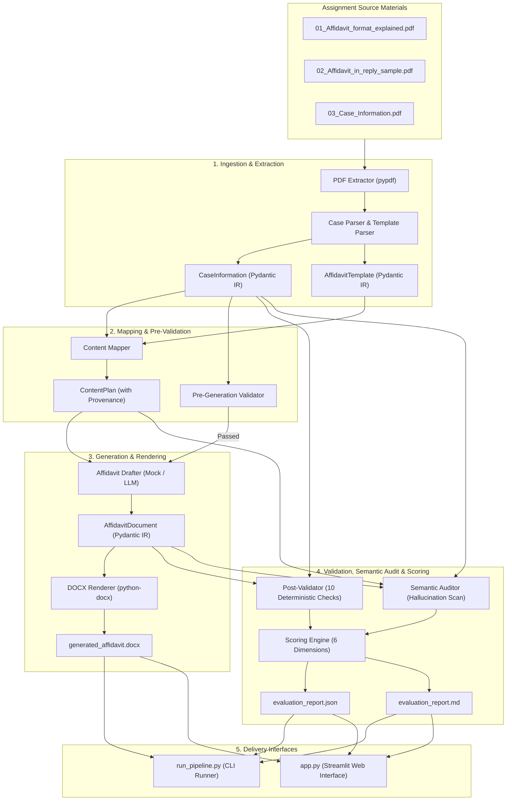

# Legal Document Generation & Evaluation Agent

AI-powered document generation and evaluation system that uses supplied reference documents and case information to generate an Affidavit in Reply and validate the generated document for entity accuracy, completeness, structure, consistency, template fidelity, and hallucination.

---

# 🔗 Live Demo
[](https://legal-document-generation-and-evaluation-agent.streamlit.app/)

## 1. Executive Summary & Problem Statement

Drafting formal court pleadings in Indian High Courts requires strict adherence to jurisdictional conventions, statutory formatting rules, and factual precision. In High Court writ practice (such as Bombay High Court Ordinary Original Civil Jurisdiction), minor structural or factual defects can lead to office objections, delays, or procedural dismissals.

Common pitfalls when using standard generative LLMs for legal drafting include:
1. **Hallucination of Legal Move Structure:** Blindly copying sample party names, case numbers, or counsel details from reference documents into the new draft.
2. **Static Invariant Violations:** For example, hardcoding verification ranges (e.g., affirming *"paragraphs 1 to 5"* when the substantive reply contains 7 paragraphs).
3. **Deponent Representation Confusion:** Failing to observe the rule that an officer deposing on behalf of a statutory authority (e.g., MMRDA) must state *"the [designation] of the Respondent No.2 above named"* rather than *"I am the Respondent No.2"*.
4. **Unreliable Self-Evaluation:** Relying on the same LLM to grade its own output without deterministic guardrails.

### The Solution: A Hybrid Neuro-Symbolic Architecture
To solve this, this repository implements a **Hybrid Architecture** combining:
- **LLM Capabilities:** Semantic understanding, legal move mapping, formal legal language synthesis, and semantic grounding evaluation.
- **Deterministic Python Engine:** Exact Pydantic schema validation, structural ordering, monotonic paragraph numbering, dynamic verification range calculation, entity matching, and transparent mathematical scoring.

---

## 2. Architecture & Data Flow



---

## 3. Division of Responsibilities: Deterministic vs. LLM

| Component | Responsible Subsystem | Rationale |
| :--- | :--- | :--- |
| **PDF Text Extraction** | Deterministic (`pypdf`) | Exact text extraction without stochastic omissions. |
| **Case Field Structuring** | Deterministic Regex + Pydantic | Guarantees exact case numbers, parties, dates, and addresses. |
| **Legal Move Mapping** | Semantic / Heuristic Engine | Maps narrative reply points to court moves (`SUBSTANTIVE_ANSWER`, `BLANKET_DENIAL`, etc.) with full source provenance. |
| **Pre-Generation Checks** | Deterministic Python | Halts pipeline if critical fields (forum, case number, prayer, deponent) are absent. |
| **Court Typography & DOCX** | Deterministic (`python-docx`) | Strict formatting: Book Antiqua 12pt, 1.5 line spacing, 1-inch margins, right-aligned status tags and jurats. |
| **Invariant Validation (10 Checks)** | Deterministic Rule Engine | Inspects the generated artifact; checks ordering, numbers, names, and dynamic verification range. |
| **Hallucination & Grounding Scan** | Semantic Auditor | Asserts facts in draft originate only from `03_Case_Information.pdf` and no sample data leaked from `02`. |
| **Scoring & Penalties** | Deterministic Math Engine | Weighted formula across 6 dimensions; deductions are auditable and reproducible. |

---

## 4. Getting Started & Installation

### Prerequisites
- Python 3.10 to 3.13 installed.
- PowerShell or standard terminal.

### Installation Steps

1. Clone or navigate to the repository directory:
   ```bash
   cd legal-document-ai-agent
   ```

2. Create and activate a virtual environment (optional but recommended):
   ```bash
   python -m venv venv
   # On Windows:
   .\venv\Scripts\activate
   # On macOS/Linux:
   source venv/bin/activate
   ```

3. Install required dependencies:
   ```bash
   pip install -r requirements.txt
   ```

---

## 5. How to Run

### A. Run via CLI Runner (Instant End-to-End Execution)
To run the full pipeline in deterministic Mock mode:
```bash
python run_pipeline.py
```
**Output Highlights:**
- Executes all 8 stages: Ingestion ? Mapping ? Pre-validation ? Drafting ? DOCX Rendering ? Post-validation ? Semantic Audit ? Scoring.
- Compiles `outputs/generated_affidavit.docx`.
- Exports `outputs/evaluation_report.json` and `outputs/evaluation_report.md`.
- Prints overall score and dimensional breakdown to stdout.

### B. Run Interactive Streamlit Web Interface
Launch the interactive reviewer dashboard:
```bash
streamlit run app.py
```
The application opens in your default browser at `http://localhost:8501`:
- **Document Inspector:** Review ground-truth case fields extracted from `03_Case_Information.pdf`.
- **Content Plan & Provenance:** Interactive table mapping each reply point to its target paragraph and source file.
- **Pre & Post Validation:** Live status of all 10 deterministic invariant checks.
- **DOCX Preview & Download:** Download the compiled court-ready Word document directly.
- **Audit & Scorecard:** Visual metrics for the 6 evaluation dimensions and downloadable JSON/Markdown reports.

### C. Run the Test Suite
Run the comprehensive Pytest test suite:
```bash
python -m pytest -v
```
All **42 tests** run in under 4 seconds, verifying schemas, parsers, mappers, drafter, DOCX renderer, negative mutation cases, post-checks, scorer, and the CLI runner.

---

## 6. Deterministic Post-Generation Checks (10 Invariants)

The post-generation validator (`src/validation/post_validator.py`) inspects the generated document representation and enforces 10 strict legal invariants:

| Check ID | Check Name | Target Legal Invariant | Severity | Evaluation Dimension |
| :--- | :--- | :--- | :--- | :--- |
| `CHK_01_REQUIRED_SECTIONS` | Required Section Presence | Court header, cause title, deponent clause, body, prayer, jurat, verification, advocate block must exist. | CRITICAL | Structure & Formatting |
| `CHK_02_SECTION_ORDER` | Section Order Invariant | Document components must follow exact High Court filing sequence without reordering. | CRITICAL | Structure & Formatting |
| `CHK_03_FORUM_JURISDICTION` | Forum & Jurisdiction Match | High Court of Judicature at Bombay, Ordinary Original Civil Jurisdiction must match case info. | HIGH | Entity Accuracy |
| `CHK_04_CASE_NUMBER_YEAR` | Case Number & Year Match | Writ Petition No. 1847 of 2026 must be present; no sample case number (e.g. 3147) permitted. | HIGH | Entity Accuracy |
| `CHK_05_PARTY_RESPONDENT_CONSISTENCY` | Party & Respondent Consistency | Petitioner (Sunrise Housing) and answering party (Respondent No. 2, MMRDA) must be consistent. | HIGH | Cross-Document Consistency |
| `CHK_06_DEPONENT_CAPACITY` | Deponent Capacity Rule | Arvind Rajan must depose as *"the Deputy Metropolitan Commissioner of the Respondent No.2 above named"*. Prohibits *"I am the Respondent No.2"*. | HIGH | Template Fidelity |
| `CHK_07_SEQUENTIAL_NUMBERING` | Sequential Numbering | Body paragraphs must be numbered monotonically $1, 2, \dots, N$ with no skipped or duplicated numbers. | HIGH | Structure & Formatting |
| `CHK_08_VERIFICATION_RANGE` | Dynamic Verification Range | Verification clause must dynamically state *"paragraphs 1 to N"* where $N$ equals actual body count ($N=7$). Hardcoding sample range ("1 to 5") fails. | CRITICAL | Cross-Document Consistency |
| `CHK_09_JURAT_VERIFICATION_VERB` | Jurat / Deponent Verb Agreement | Deponent clause verb (*"solemnly affirm"*) and Jurat verb (*"Solemnly affirmed"*) must agree grammatically. | MEDIUM | Template Fidelity |
| `CHK_10_PRAYER_EXHIBIT` | Prayer Structure & Exhibit Grounding | Prayer must seek petition dismissal; all cited exhibits (EXHIBIT-'A') must match case materials. | HIGH | Completeness |

---

## 7. Evaluation Methodology & Scoring Engine

The evaluation framework evaluates the generated draft across **6 weighted dimensions** mandated by legal evaluation standards:

$$S_{\text{Overall}} = 0.20 \cdot S_{\text{Entity}} + 0.15 \cdot S_{\text{Completeness}} + 0.15 \cdot S_{\text{Structure}} + 0.15 \cdot S_{\text{Consistency}} + 0.15 \cdot S_{\text{Fidelity}} + 0.20 \cdot S_{\text{Hallucination}}$$

### Dimensional Weight Allocation
1. **Entity Accuracy (20%):** Exact match of court forum, case number (1847), year (2026), petitioner, respondents, and deponent details.
2. **Completeness (15%):** Inclusion of all 6 substantive reply points, closing statement, prayer clause, and relied-upon exhibits.
3. **Structure & Formatting (15%):** Presence and ordering of all mandatory parts, sequential numbering, and court typography standards.
4. **Cross-Document Consistency (15%):** Dynamic agreement between substantive paragraph count and the verification clause affirmance range.
5. **Template Fidelity (15%):** Correct Bombay High Court phraseology, proper jurat attestation, and correct authority deponent representation.
6. **Hallucination & Leakage Audit (20%):** Rigorous verification that no facts, parties, or dates outside `03_Case_Information.pdf` were invented, and zero sample data from `02_Affidavit_in_reply_sample.pdf` leaked into the draft.

### Deduction Rules
Every detected issue applies an auditable deduction to its corresponding dimension:
- **CRITICAL:** -25.0 points (e.g., missing required section, invalid verification range).
- **HIGH:** -15.0 points (e.g., entity mismatch, broken numbering, missing exhibit).
- **MEDIUM:** -10.0 points (e.g., jurat verb disagreement).
- **LOW:** -5.0 points (minor typographic discrepancy).

---

## 8. Test Suite Summary

The repository includes a comprehensive test suite in `tests/`:

```
tests/
+-- test_schemas.py           # 5 tests: Pydantic constraints, deponent capacity rules, dynamic verification invariants
+-- test_ingestion.py         # 3 tests: pypdf extraction, case parser, authoritative template parser
+-- test_mapping.py           # 3 tests: legal move mapping, point coverage, evidence provenance tracking
+-- test_pre_validator.py     # 7 tests: mandatory field gates, missing points, unmatched respondents
+-- test_generation.py        # 6 tests: mock drafting, 7 body paragraphs, dynamic range, docx rendering
+-- test_evaluation.py        # 14 tests: 10 deterministic checks, intentional negative mutations, scorer
+-- test_pipeline.py          # 4 tests: full e2e pipeline run, pre-validation failure branch, CLI runner, input preservation
```
**Total:** **42 passed in 3.39s** (100% pass rate).

---

## 9. Key Technical Decisions & Lessons Learned

1. **Dynamic Verification Range ($N=7$ vs $N=5$):**
   A fundamental flaw in naive LLM generation is copying the verification formula verbatim from sample documents (*"paragraphs 1 to 5"*). In our case, the deponent has 6 substantive points plus 1 closing paragraph ($N=7$). The system dynamically enforces that the verification affirmation affirms *"paragraphs 1 to 7"*. Any deviation fails both Pydantic schema validation and `CHK_08_VERIFICATION_RANGE`.

2. **Statutory Authority Deponent Rule:**
   Under High Court practice, when an authority (MMRDA) is sued, an authorized officer deposes on its behalf. The phrasing must read:
   > *"I, Arvind Rajan, ... the Deputy Metropolitan Commissioner of the Respondent No.2 above named, do hereby solemnly affirm and state as under..."*
   Saying *"I am the Respondent No.2"* is legally incorrect. The schema and `CHK_06` strictly enforce this legal convention.

3. **Pure Python Invariant Safety Net:**
   LLMs cannot be trusted to reliably count paragraphs or verify exact integer bounds. By validating invariants through deterministic Python functions, the system guarantees 100% adherence to court rules regardless of LLM temperature or provider variances.

---

## 10. Scope & Limitations

- **Proof of Concept:** Designed specifically for the Bombay High Court Affidavit in Reply assignment materials (`01`, `02`, `03`).
- **No External Legal Research:** As specified in the assignment constraints, the system operates strictly on supplied materials and does not invent facts or cite unsupplied case laws.
- **No Heavy Infrastructure:** Intentionally lightweight and self-contained; does not require databases, vector stores, Docker, Kubernetes, or complex multi-agent frameworks.

---

## 11. AI Assistance Disclosure

In compliance with the assignment instructions:
- **AI Coding Assistant:** This project was developed with the assistance of Antigravity (Google DeepMind Advanced Agentic Coding).
- **Engineering Responsibility:** Architecture design, schema modeling, invariant checks, deterministic rules, test fixtures, negative mutation scenarios, and pipeline integration were conceived, verified, and reviewed by the candidate.
